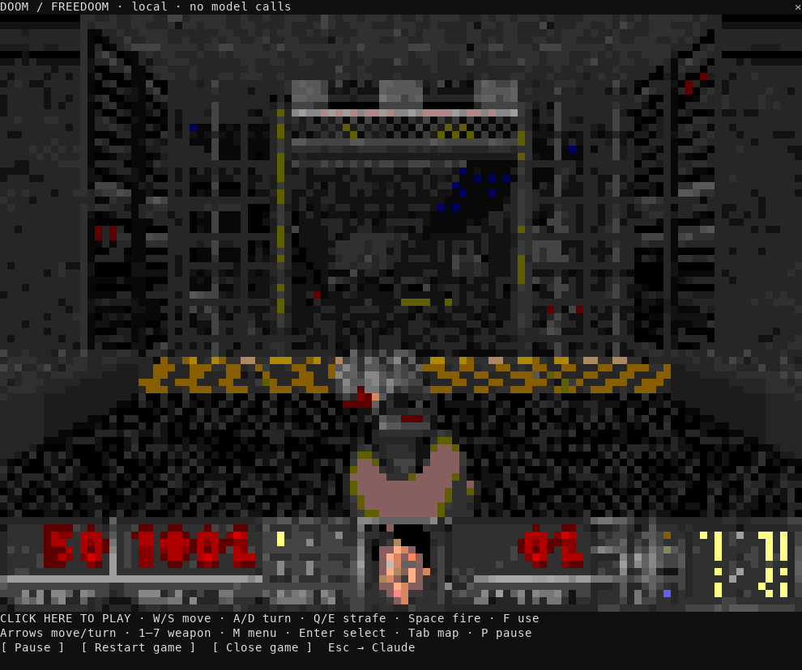

# DOOM for Claude Code

The original Doom engine. Freedoom's freely licensed game assets. A live game pane inside Claude Code, opened with **`/doom`**.

**Mac Apple Silicon alpha · macOS 14+ · Node.js 22+ · Claude login required**



The clip is rendered from real terminal output during gameplay. The engine runs locally; playing makes no model calls.

## Play the alpha

[Download v0.1.0-alpha.2 for Mac Apple Silicon](https://github.com/ChaseWNorton/claude-doom/releases/download/v0.1.0-alpha.2/claude-doom-v0.1.0-alpha.2-darwin-arm64.zip), extract it, then run this from the extracted `claude-doom` folder:

```sh
bash scripts/play.sh
```

Enter **`/doom`**, then **click the keyboard strip below the game**. Escape gives the keyboard back to Claude. Use a terminal with true color and mouse reporting, preferably at least 110 columns × 50 rows.

The ZIP includes the compiled engine, full corresponding source, Freedoom assets, and licenses. **No compiler is needed.** The launcher checks the platform and binary checksum, uses Claude Code **2.1.278** if installed, or installs that exact version into this folder. It enables Mods and fullscreen terminal rendering for that session. Claude Code is downloaded separately from Anthropic and requires your own login.

To verify the download in a terminal, download the neighboring `.zip.sha256` asset from the [release page](https://github.com/ChaseWNorton/claude-doom/releases/tag/v0.1.0-alpha.2) and run:

```sh
shasum -a 256 -c claude-doom-v0.1.0-alpha.2-darwin-arm64.zip.sha256
```

## Install through Claude's marketplace

Start the tested Claude version with Mods and mouse-capable rendering enabled:

```sh
CLAUDE_CODE_ENABLE_FUNCTION_HOOKS=1 CLAUDE_CODE_NO_FLICKER=1 \
  npx --yes @anthropic-ai/claude-code@2.1.278
```

Then run these commands inside Claude:

```text
/plugin marketplace add ChaseWNorton/claude-doom
/plugin install doom@faros-labs
/reload-plugins
/doom
```

Choose the installation scope in Claude's install dialog. Keep the two environment flags when starting future sessions. If an organization disables third-party plugins or function hooks, this mod cannot override that policy. [Claude marketplace documentation](https://code.claude.com/docs/en/plugin-marketplaces).

## Controls

| Key | Action |
| --- | --- |
| W / S, Up / Down | Move forward / backward |
| A / D, Left / Right | Turn |
| Q / E | Strafe |
| Space | Fire |
| F | Use / open doors |
| 1–7 | Select weapon |
| M / Enter | Game menu / select |
| Tab | Automap |
| P | Pause / resume |
| Escape | Give the keyboard back to Claude |

The pane also has Pause, Restart game, and Close game buttons. From Claude's composer, use `/doom pause`, `/doom restart`, or `/doom close`. Restart begins episode 1, map 1, medium difficulty.

## Alpha limits

- **Silent:** audio is not implemented in this adapter.
- **Temporary saves:** saves and settings are deleted when the game closes.
- **Terminal controls:** key repeat approximates held keys; movement is less precise than in a dedicated game window.
- **Mac Apple Silicon only:** Intel Mac, Linux, and Windows binaries are not included in this release.
- **Early-access API:** Claude Code 2.1.278 is the tested runtime. Other versions may need adapter changes.

If clicks do nothing, use the launcher or the environment flags above, enable your terminal's mouse reporting, and check that `CLAUDE_CODE_DISABLE_MOUSE`, `CLAUDE_CODE_DISABLE_MOUSE_CLICKS`, and `CLAUDE_CODE_DISABLE_ALTERNATE_SCREEN` are not disabling interaction. [Fullscreen renderer documentation](https://code.claude.com/docs/en/fullscreen).

## How it works

`hooks/register.ts` opens a native Mod pane. A Node bridge starts the compiled [doomgeneric](https://github.com/ozkl/doomgeneric) engine, reads its actual 320×200 framebuffer through a pipe, and converts it to half-block terminal pixels. Claude's `Raster` and `$.ui.blit` display the game. A focused `Client` module sends keyboard input back to the engine.

The bridge listens on an ephemeral `127.0.0.1` port with a random per-game token. It makes no external requests. Game frames are not added to the conversation. Closing the mod ends the game, and an abandoned bridge exits after 60 seconds without a client. This all happens within a normal authenticated Claude session.

## Build and verify

Building from source additionally requires a C compiler and Git. On macOS, install Apple's Command Line Tools. From a clone:

```sh
npm run setup:dev
npm run build
npm test
npm run typecheck
CLAUDE_CODE_ENABLE_FUNCTION_HOOKS=1 .runtime/node_modules/.bin/claude plugin test .
npm run package
npm run test:package
```

Development setup downloads the pinned, checksum-verified API declarations from Anthropic and installs the tested Claude runtime and TypeScript under `.runtime`. Those files are not redistributed. See [Anthropic's Mods API](https://github.com/anthropics/claude-code/blob/main/mods/README.md).

Native tests verify actual movement, rotation, ammunition, pause/resume, restart, raster output, authorization, and process cleanup. Package tests extract the ZIP into a fresh directory and exercise its included engine without compiling. The official Mod test verifies pane rendering and keyboard forwarding. A Mac CI job repeats these checks on a fresh runner.

`tests/terminal-smoke.py` drives real Claude through a PTY with a logged-in account; its test-only dependencies are `pyte` and Pillow. `npm run preview` prints a local browser URL for diagnosing the same native engine. The browser is a separate diagnostic view.

See [release procedure](docs/RELEASING.md) for packaging and publishing details.

## Licenses and credits

- Engine: doomgeneric revision `dcb7a8dbc7a16ce3dda29382ac9aae9d77d21284`, derived from the original Doom source, **GPL-2.0-or-later**. Complete corresponding source is in `vendor/doomgeneric`; the platform adapter is in `native/doomgeneric_claude.c`. Build scripts are included.
- Game data: **[Freedoom Phase 1, version 0.13.0](https://github.com/freedoom/freedoom/releases/tag/v0.13.0)**, under its permissive BSD license. License and contributor credits are retained in `assets`.
- This mod's code is GPL-2.0-or-later. Download provenance is in `vendor/provenance.json`. See [third-party notices](THIRD_PARTY_NOTICES.md).

No commercial Doom assets are included. This is an independent experiment, not an official Anthropic, id Software, or Freedoom product.
